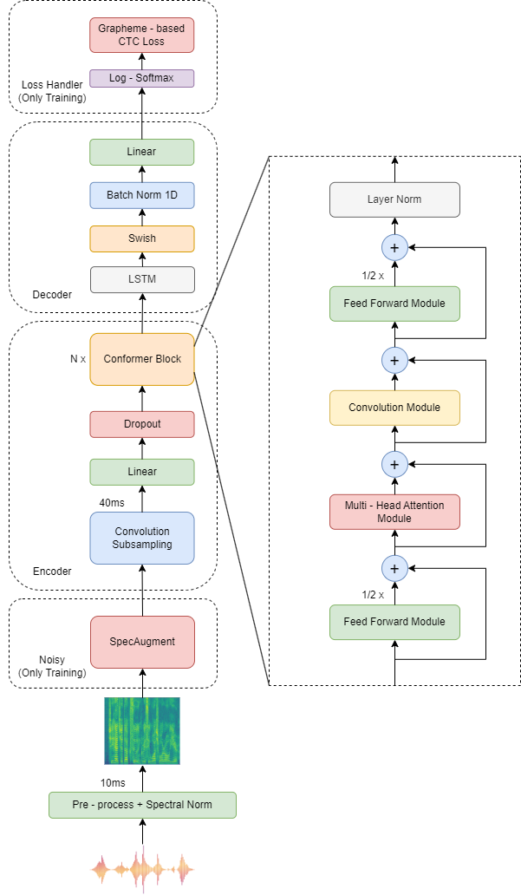
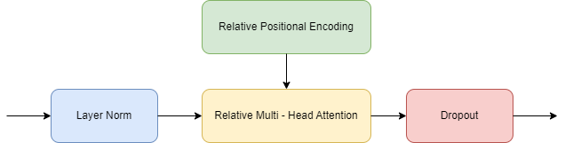
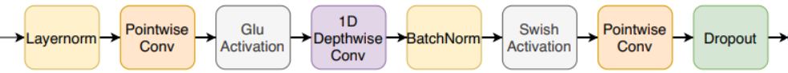
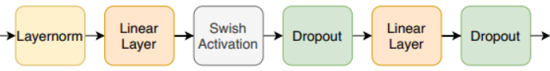
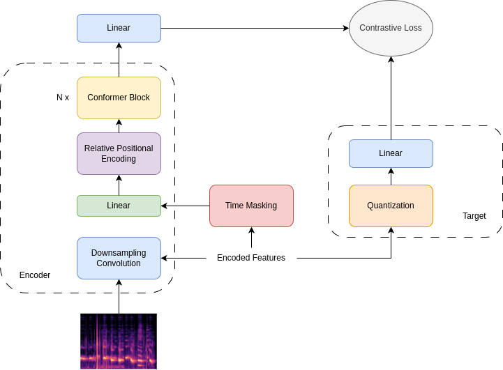

# (Speech to Text) Convolution - augmented Transformer
## Model Architecture


### Relative Multi - Head Attention Module


### Convolution Module


### Feed Forward Module


### BYOL Pre - train Unlabeled Data


## Folder Structure
```
assets
configs
preprocessing
|---processor.py
pretraining
|---byol.py
src
|---modules
|---|---decoder.py
|---|---encoder.py
|---utils
|---|---activation.py
|---|---attention.py
|---|---block.py
|---|---convolution.py
|---|---ffn.py
|---|---masking.py
|---|---position.py
|---conformer.py
|---loss.py
|---metric.py
vocabulary
.gitignore
build_lm.py
build_onnx.py
dataset.py
infer.py
pretrain.py
README.md
requirements.txt
test.py
train.py
```

## Setup Environment
```
git clone https://github.com/Alan-404/Conformer.git
cd Conformer
python3 -m venv venv
source venv/bin/activate
pip install -r requirements.txt
```

## Train
```
CUDA_VISIBLE_DEVICES={index} python3 train.py --device cuda --batch_size {train_batch_size} --val_batch_size {val_batch_size} --num_epochs {number_of_epochs}
```