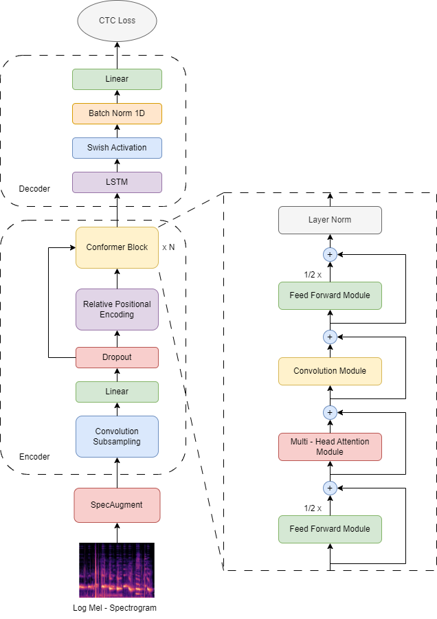
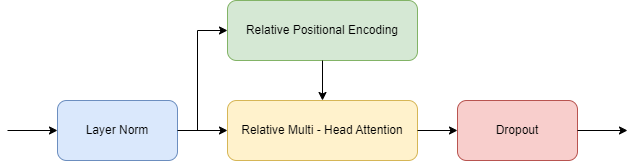
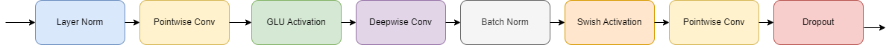
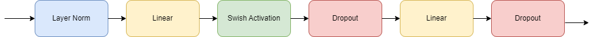

# (Speech to Text) Conformer Model

## Model Architecture


## Unsupervised Training


## Semi - Supervised Training


### Multi - Head Attention Module


### Convolution Module


### Feed Forward Module


## Folder Structure
```
assets
configs
preprocessing
|---processor.py
pretraining
|---byol.py
src
|---modules
|---|---decoder.py
|---|---encoder.py
|---utils
|---|---activation.py
|---|---attention.py
|---|---block.py
|---|---convolution.py
|---|---ffn.py
|---|---masking.py
|---|---position.py
|---conformer.py
|---loss.py
|---metric.py
vocabulary
.gitignore
build_lm.py
build_onnx.py
dataset.py
infer.py
pretrain.py
README.md
requirements.txt
test.py
train.py
```

## Setup Environment
```
git clone https://dagshub.com/Tri_0401/Conformer.git
cd Conformer
python3 -m venv venv
source venv/bin/activate
pip install -r requirements.txt
```

## Pull Dataset (CSV Files)
```
dvc pull
```

## Setup KenLM
<i>The Setup Intruction is followed by the git: https://github.com/kpu/kenlm.git</i>

```
sudo apt install cmake build-essential libboost-system-dev libboost-thread-dev libboost-program-options-dev libboost-test-dev
git clone https://github.com/kpu/kenlm.git
cd kenlm
mkdir -p build
cd build
cmake ..
make -j 4
```

## Train ASR Model
```
CUDA_VISIBLE_DEVICES={index} python3 train.py --device cuda --batch_size {train_batch_size} --val_batch_size {val_batch_size} --num_epochs {number_of_epochs}
```

## Train KenLM Model for BEAM Search
```
kenlm/build/bin/lmplz -o {n_gram} --text {text_path} --arpa {lm_path}
```
